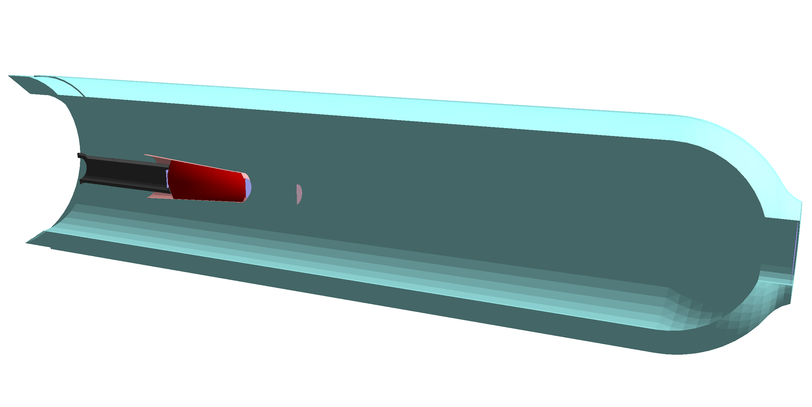

# Geometry Import from Engineering Model to GEMC

## Shell One Liners:

- `pwd`: show current directory
- `TAB`: autocomplete with filenames in current directory
- `ls -l`: show content of current director
- `cd`: change directory
- `cd ..`: go up one level
- `mkdir`: create directory
- `rm -f filename`: remove file

## Git One Liners:

- `git clone`: clone a repository
- `git pull`: pull changes from remote repository
- `git add`: add file to repository
- `git commit -m "message"`: commit changes to repository with message
- `git status -s`: show status of repository
- `git log`: show log of commits
- `git push`: push changes to remote repository

## General guidelines

### 1. Filter out unnecessary volumes.  

Needed: all objects that can interact with particles. This can be tricky at first,  
We can sit down together to identify them 

- Definitely need all materials (windows) along the beam 
- All shielding (tungsten cone, etc)
- Vacuum pipes 
- Volumes in the way of particles in the active regions, i.e. HTCC windows
- Volumes in passive regions that can produce secondaries, i.e. torus coils and plates

An example of target imported in out simulation framework is shown in the picture below:

### 2. Simplify volumes:
- If volumes are touching and are the same material, unite them if possible
- If objects have holes (for example, for bolts), smooth them out if possible

### 3. Reference System: 

Our reference system has the “theoretical” CLAS center at (0,0,0) and z axis along the beam.
The distance between our center and the engineering Hall-B center is 1273.27mm

A PDF showing the distance of critical elements to the moller shield could be used as general 
validation of their positions. 

